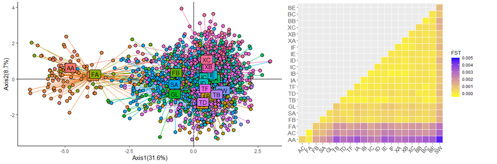

  

# Population structure of the swordfish, Xiphias gladius, across the Indian Ocean using Next Generation Sequencing

This repository contains all necessary components for results obtained in the paper.

## Abstract
Swordfish (Xiphias gladius) is of significant economic importance as it is the second most exploited billfish in the Indian Ocean. While the Indian Ocean Tuna Commission (IOTC) considers X. gladius to be a single panmictic population in the Indian Ocean, several studies have examined the potential for spatial variations occurring within this highly-migratory species with conflicting results, including emerging evidence that population structuring does indeed exist within X. gladius. These findings therefore call into question the current guidelines for management adopted by the IOTC. In the present study, we sought to resolve questions surrounding the genetic structuring of X. gladius in the Indian Ocean through the analysis of two datasets with and without SNPs under potential selection identified from 1 694 swordfish originating from 23 distinct locations across the Indian Ocean. Further, a Discriminant Analysis of Principal Components (DAPC) statistical technique was designed to identify and describe clusters of genetically related individuals. Our results have highlighted the presence of two swordfish sub-populations in the Indian Ocean in the north and the south. This genetic differentiation may be explained by regions of the genome subject to selection pressure, indicating that both populations are demographically connected but remain differentiated by selective pressure. 
